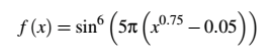
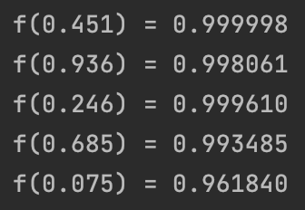

# SequentialNishing

My realization of multimodal evolutionary algorithm called sequential nishing.

## Goal

Study of multimodal algorithms for finding several local maxima of a function.

## Function

Scope of definition is [0; 1].

## Explanation

An interesting algorithm called [sequential nishing](https://direct.mit.edu/evco/article-abstract/1/2/101/1103/A-Sequential-Niche-Technique-for-Multimodal?redirectedFrom=fulltext) proposed by Beasley et al. In this method after searching for a global optimal solution using any search algorithm, including an evolutionary one, we can change the landscape of the solution in such a way that the attraction to the region is already the found peak is penalized to ensure that the next time the search algorithm is run, another peak is found. Continuing the process described above, we will find several consecutive peaks. The key to a consistent niche is _changing the landscape_ of the solution. As a rule, the punishment for striving to the area of the already found peak(s) means a decrease in the values of the objective function in these peaks.

Disadvantage of the sequential niche is the sequential approach, that is, one run per peak, which is inefficient for real-time applications.

## Result

Max points and their values are printed in console.

In animation below you can see how this algorithm works.

